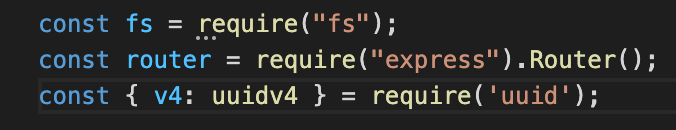
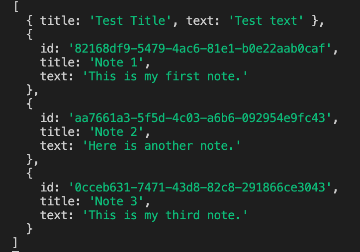

# noteTaker 

  ## Table of Contents
  1. [Description](#description)
  1. [Installation](#installation)
  1. [Usage](#usage)
  1. [License](#license)
  1. [Contributing](#contributing)
  1. [Tests](#tests)
  1. [Questions](#questions)

  ## Description

  The noteTaker application is an efficient way to write, save and delete notes.  It allowe the user to create a note with a title and description and save it to the application.  It will also allow the user to delete the note when it is no longer needed.

  ## Video Demo

  
  [Deploy](https://notetakerprofessional.herokuapp.com/)

  ## Installation

  To install this application the user must have node.js installed.  The node depencies that are required are path, file system express using Router and uuidv4.
  
  


  ## Usage

  To get started with the application, run ```node server.js``` in the terminal to start the server.  The user will be taken to the homepage complete with a navbar and a Get Started button.  When the button is clicked, the user will be brought to notes page with the ability to save and enter notes.  The notes will stay in the application until the user deletes them.

  On the backend, the application will read and write the json.db file each time a GET, POST or DELETE request is made.  The json.db file will be updated to reflect the current changes.

  ## License

  [The Unlicense](http://unlicense.org/)

  This project is licensed under [The Unlicense](http://unlicense.org/).  Please visit the link for more details.


  ## Contributing

  There were no contributors on this project, but collaboration is welcome.  Please feel free to reach out to me regarding changes to the application by creating an issue in Github or contacting me through email.

  ## Tests

  The notes are deleted by selected a unique id using uuidv4. To test that the req.params has the correct information, log to the console.  Also use console.log to make sure the server is runnign and return any errors that may be occuring on the backend to reflect in the terminal.
  
  


  ## Questions

  **Github:** [dargenioa](http://github.com/dargenioa)

  **Email:** [dargenioa14@gmail.com](dargenioa14@gmail.com)

  For additional questions please feel free to contact me.


